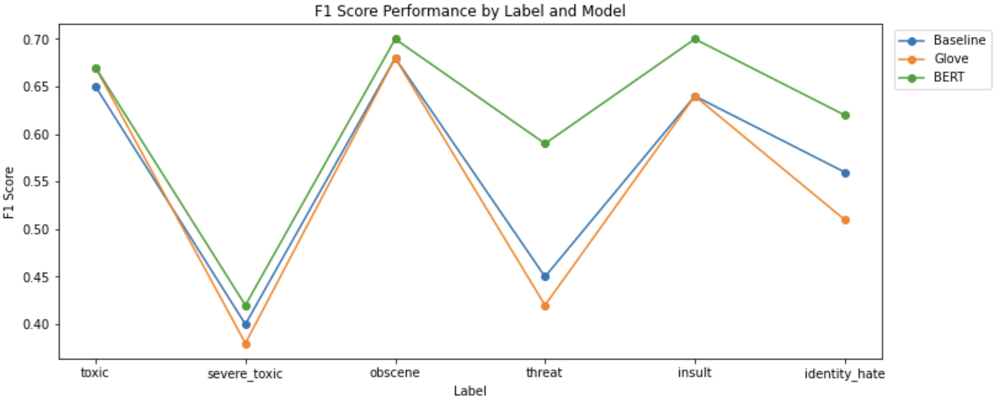

# Toxic Comment Classification

# Introduction
The work carried out in this notebook focused on the [Jigsaw Toxic Comment Classification Challenge](https://www.kaggle.com/c/jigsaw-toxic-comment-classification-challenge) hosted on [Kaggle](https://www.kaggle.com/). The task consists of a **Multilabel text classification** problem where a given toxic comment, needs to be classified into one or more categories out of the following list:
- `toxic`
- `severe_toxic`
- `obscene`
- `threat`
- `insult`
- `identity_hate`

For instance, if the comment is `toxic` and `obscene`, then for both those headers the value will be `1` and for the others it will be `0`.

# Data

- We are using the [Jigsaw toxic data](https://www.kaggle.com/competitions/jigsaw-toxic-comment-classification-challenge/data) prived by the competition
- We are referring only to the following csv files from the data dump: `train.csv`, `test.csv`, `test_labels.csv`
- Now that the competition has ended, the labels for the test set have been provided. This will enable us to conduct inference and assess the performance of each tested model.

# Models
I employed three distinct models using TensorFlow to address the challenge:
- **MODEL I**: a baseline approach that utilized a **Bidirectional Long Short-Term Memory (LSTM)** network with **embeddings trained from scratch**.
- **MODEL II**: a variation of the baseline approach that incorporated **Glove's pre-trained embeddings** with the Bidirectional LSTM architecture.
- **MODEL III**: the well-known **BERT model**, which is capable of producing state-of-the-art results on a range of NLP tasks including text classification.

By utilizing these three models, I aimed to determine which approach would yield the most effective results for this particular task.

# **Evaluation metric**
For the evaluation of my models in the Toxic Comment Challenge competition, I opted to use the **macro-averaged F1 score** as the reference metric, rather than AUC-ROC as recommended by the competition guidelines. I believe F1 to be a more appropriate metric for the following reasons: 
- the F1 score is a more comprehensive metric that takes both precision and recall into account and provides a more nuanced assessment of the model's performance across all the different classes. This is particularly important in the Toxic Comment Challenge, where identifying and categorizing multiple types of toxic comments is crucial.
- Moreover, the macro-averaged F1 score does not take class imbalance into account, which ensures that every class is given equal weight independently of its proportion. This is important in imbalanced datasets where one or more classes may be significantly underrepresented.
- In contrast, AUC-ROC can be misleading in case of imbalanced data, as it only considers the overall performance of the model without taking into account class imbalance. 
- By prioritizing F1 over AUC-ROC, I aimed to ensure that my models were optimized for real-world applications.

# Results

The table below summarizes the F1 scores of the tested models on the six labels associated with toxic comments, along with their F1 macro average. In addition, the graphical visualization provided by the plot allows for an easier comparison between the models' performances across different labels.

  
| Model Name         | toxic | severe_toxic | obscene | threat | insult | identity_hate | F1 macro avg |
|--------------------|-------|--------------|---------|--------|--------|---------------|--------------|
| Model I (Baseline) | 0.65  | 0.40         | 0.68    | 0.45   | 0.64   | 0.56          | 0.56         |
| Model II (Glove)   | 0.67  | 0.38         | 0.68    | 0.42   | 0.64   | 0.51          | 0.55         |
| Model III (BERT)   | 0.67  | 0.42         | 0.70    | 0.59   | 0.70   | 0.62          | 0.62         |
  

  

